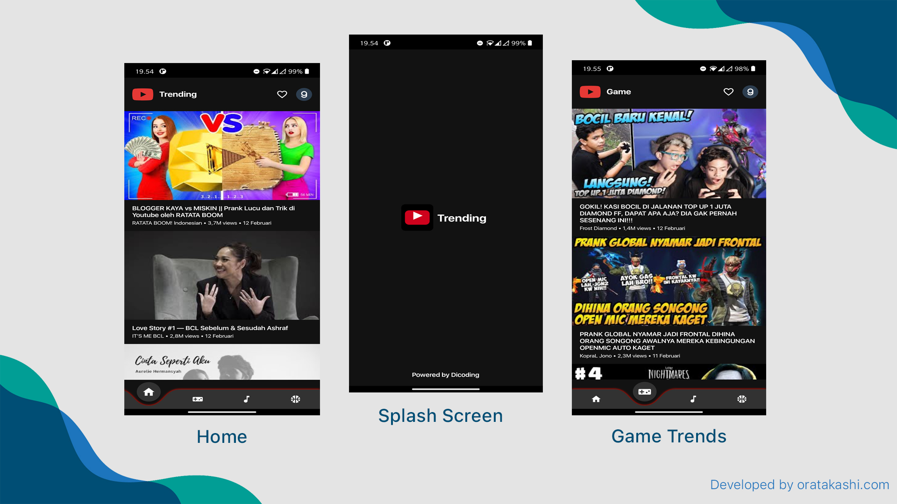
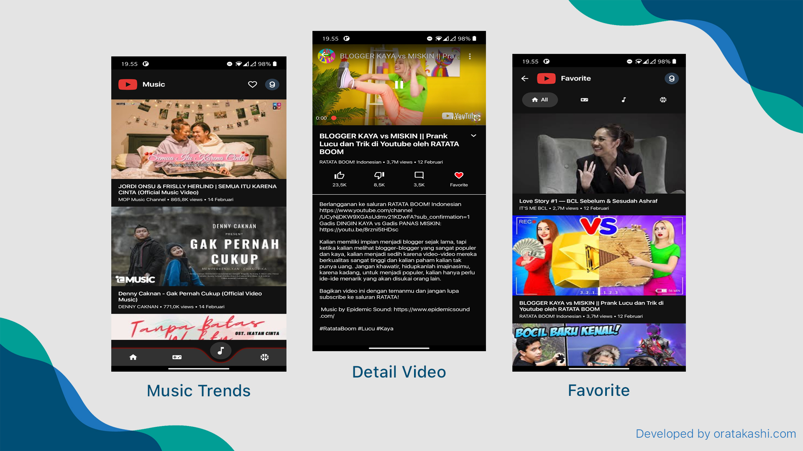

<p align="center">
  <a href="#">
		<h1 align="center">Youtube Trends</h1>
  </a>
</p>
<p align="center">
  Youtube Trends merupakan aplikasi Submission dari Kelas Menjadi Android Developer Expert Dicoding Indonesia, disini menerapkan prinsip Clean Architecture,
</p>

<span align="center">
 <hr>
 <p align="center"></p>
 <p align="center">Screenshot</p>
 <hr>
  <p align="center"></p>
 <p align="center">Screenshot</p>
 <hr>
 </span>
 <h1>Download Demo</h1>
https://github.com/oratakashi/YoutubeTrends/releases/download/1.0/app-debug.apk
 <br>
 
 ### Continuous Integration
 
 [](https://circleci.com/gh/oratakashi/YoutubeTrends)
 [](https://travis-ci.com/oratakashi/YoutubeTrends)
 [](https://app.buddy.works/davidcreazy/youtubetrends/pipelines/pipeline/307514)
 
 ### Apps Feature:

- Show Main Youtube Trends
- Show Game Youtube Trends
- Show Music Youtube Trends
- Show Sport Youtube Trends
- Trends Favorite
- Detail Video's with Video's Streaming

### Project Spesification :
- Build with Kotlin and Jetpack ViewBinding
- Android Material with Android SDK version 30.0.3
- Gradle version 4.1.2
- Networking :
  - OkHttp
  - Retrofit
  - RxJava
  - SSL Pinning
- Database :
  - Room Database
  - SQLChiper for Database Encryption
- Kotlin Reflection
- Koin Dependency Injection
- Project Architecture :
  - Clean Architecture
  - MVVM Design Pattern
  - SOLID Principal
- Animation :
  - Lottie Animation
  - Shimmer Animation

### Project Structure :

- Module App : Berfungsi untuk Module utama aplikasi, yang berisi Main UI dan beberapa utility
- Module Core : Berfungsi untuk module yang menangani Depedency Injection dan Application Class
- Module Data : Berfungsi sebagai layer data yang berisi :
   - Room Database dan Dao
   - Kotlin Reflection untuk mapping data dari layer data ke layer domain di Package Magic
   - Model untuk layer data
   - Network Interface
   - Local Repository dan Remote Repository
- Module Domain : Berfungsi sebagai layer domain yang berisi :
   - Interactor
   - Annotation Class untuk digunakan Kotlin Reflection yang berada di Package Magic
   - Model untuk layer domain
   - Repository
   - State management untuk layer domain
   - Usecase
- Module Presentation : Berfungsi sebagai layer presentation yang berisi :
   - ViewModel
   - Model untuk layer presentation
   - Kotlin Reflection untuk mapping data dari layer domain ke layer presentation di Package Magic
   - State management untuk layer presentation
   - Module Favorite : Merupakan module DFM / Dynamic Feature Module

### Obfuscation :

- Module app :
   - proguard-rules.pro : berisi rules untuk keep class-class material dan androidx
- Module core :
   - consumer-rules.pro : berisi rules untuk keep class-class library :
      - Retrofit
      - Gson
      - SQLChiper
- Module data :
  - consumer-rules.pro : berisi rules untuk keep class-class library :
      - Retrofit
      - Gson
      - SQLChiper
      - Kotlin Reflect ( Extended Library untuk reflection di kotlin )
      - dan Mengkeep data class di Package Model agar reflection bisa berjalan
- Module domain :
      - consumer-rules.pro : berisi rules untuk keep class-class library :
      - Retrofit
      - Gson
      - SQLChiper
      - Kotlin Reflect ( Extended Library untuk reflection di kotlin )
      - dan Mengkeep data class di Package Model agar reflection bisa berjalan
- Module Presentation :
   - consumer-rules.pro : berisi rules untuk keep class-class library :
      - Retrofit
      - Gson
      - SQLChiper
      - Kotlin Reflect ( Extended Library untuk reflection di kotlin )
      - dan Mengkeep data class di Package Model agar reflection bisa berjalan

### Encryption :

- Module data :
   - SQLChiper digunakan di Class RoomDB

### Certificate Pinning :

- Module core :
   - CoreModule : provideHttpClient menggunakan OKHttp
 

### Setup
  1. Anda harus membuat API Key Google Cloud Console pada situs <a href="https://console.cloud.google.com/?hl=id&pli=1">Google Cloud Console</a>
  2. Masukkan Api Key yang sudah dibuat pada config seperti berikut:
	 **core/Config.kt**
```kotlin
object Config {
    const val key : String = "{{YOUR API KEY}}"
}
```
  3. Click menu di menubar **Build/Rebuild Project**
  4. Project siap di jalankan
<br>
 <h1>Creator</h1>
 <p>Youtube Trends is created by [Oratakashi](http://github.com/oratakashi)</p>
 <p>You can contact me at : oratakashi@oratakashi.com</p>
 <h1>License</h1>
 <p>Youtube Trends Apps is under the [GPL3 License](LICENSE)</p>
